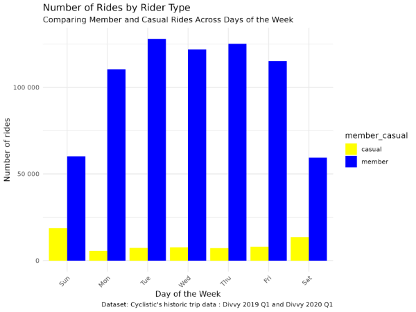
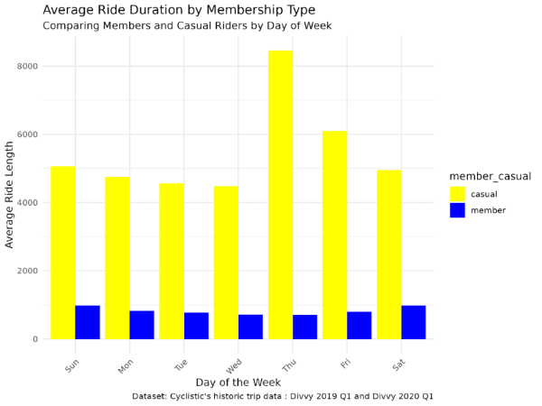

# Cyclistic-Bike-Share-Data-Analysis
## Introduction
Welcome to the Cyclistic Bike-Share Analysis Case Study! In this case study, the task is to explore historical bike trip data to understand how casual riders and annual members use Cyclistic bikes differently. The company aims to increase the number of annual memberships, as they are more profitable than casual rides. The marketing team seeks to identify trends and behaviors that can inform a strategy to convert casual riders—who currently use single-ride or full-day passes—into annual members. This analysis will uncover key insights into rider behavior and provide data-backed recommendations to shape future marketing campaigns, ultimately answering the question: **How do annual members and casual riders use Cyclistic bikes differently?**

## Data Description
The dataset used in this analysis includes historical bike trip records from Cyclistic’s bike-share program, specifically from [Divvy 2019 Q1](Datasets/Divvy_Trips_2019_Q1.csv) and [Divvy 2020 Q1](Datasets/Divvy_Trips_2020_Q1.csv), which were combined into a single dataset for analysis. The combined dataset contains a total of 791,956 rows, representing bike trips from both time periods. It captures detailed information on bike rentals, allowing the comparison in the behavior of annual members and casual riders. Note that while column names differed slightly between the two datasets, they refered to the same concepts. Below were the key columns in the dataset, separated into **raw data** and **calculated columns**:

#### Raw Data Columns:
- ride_id (or trip_id): A unique identifier for each bike trip.
- rideable_type (or bike_type): The type of bike used for the trip (e.g., traditional bike, reclining bike, cargo bike, hand tricycle).
- start_time (or started_at): The timestamp for when the trip began.
- end_time (or ended_at): The timestamp for when the trip ended.
- start_station_name (or from_station_name): The name of the station where the trip started.
- end_station_name (or to_station_name): The name of the station where the trip ended.
- member_casual (or user_type): Indicates whether the rider is a casual rider or an annual member.

#### Calculated Columns:
- ride_length: The total duration of the trip in seconds.
- day_of_week: The day of the week the trip occurred.

These datasets covered trips from **Q1 2019** and **Q1 2020**, and by analyzing the trip details, we can identified usage patterns that differentiated casual riders and annual members.

## Data Preprocessing
The data preprocessing involved cleaning, transforming, and merging the two datasets to prepare for analysis. Below is a summary of the key steps:

#### 1. Data Collection
Data from Divvy trips for **Q1 2019** and **Q1 2020** were loaded into RStudio using the **read_csv()** function.

```r
# Uploaded Divvy datasets (csv files) here
q1_2019 <- read_csv("Divvy_Trips_2019_Q1.csv")
q1_2020 <- read_csv("Divvy_Trips_2020_Q1.csv")
```
#### 2. Data Wrangling and Merging
The columns in the 2019 dataset were renamed to make them consistent with the 2020 dataset. The two datasets were then combined using **bind_rows()** function into one data frame, all_trips. The columns: start_lat, birthyear, and gender, were removed as they were no longer valid beginning 2020.
```r
# Rename columns  to make them consistent with q1_2020
q1_2019 <- rename(q1_2019
                   ,ride_id = trip_id
                   ,rideable_type = bikeid
                   ,started_at = start_time
                   ,ended_at = end_time
                   ,start_station_name = from_station_name
                   ,start_station_id = from_station_id
                   ,end_station_name = to_station_name
                   ,end_station_id = to_station_id
                   ,member_casual = usertype
                   )
# Stack individual quarter's data frames into one big data frame
all_trips <- bind_rows(q1_2019, q1_2020)
# Remove lat, long, birthyear, and gender columns
all_trips <- all_trips %>%  
  select(-c(start_lat, start_lng, end_lat, end_lng, birthyear, gender,  "tripduration"))
```
#### 3. Data Cleaning and Transformation
The following actions were perfomed with regards to data cleaning and transformation:

  - The member_casual column was standardized by replacing the older labels as follows: the two names for members - "member" and "subscriber", and the two names     for casual riders -       "customer" and "casual" were replaced by "member" and "casual" respectively.
    ```r
    all_trips <-  all_trips %>% 
    mutate(member_casual = recode(member_casual
                                ,"Subscriber" = "member"
                                ,"Customer" = "casual"))
    ```
  - Additional columns for date, month, day, year, and day_of_week were added to facilitate aggregation.
    ```r
    all_trips$date <- as.Date(all_trips$started_at) #The default format is yyyy-mm-dd
    all_trips$month <- format(as.Date(all_trips$date), "%m")
    all_trips$day <- format(as.Date(all_trips$date), "%d")
    all_trips$year <- format(as.Date(all_trips$date), "%Y")
    all_trips$day_of_week <- format(as.Date(all_trips$date), "%A")
    ```
  - A ride_length column, calculated by subtracting started_at from ended_at, was added to the **all_trips** data frame since the Q1 2020 data did not have the tripduration column. The       new column was then converted to a numeric format for analysis.
    ```r
    # "ride_length" in seconds
    all_trips$ride_length <- difftime(all_trips$ended_at,all_trips$started_at)
    # Converted "ride_length" from Factor to numeric so we could run calculations on the data
    is.factor(all_trips$ride_length)
    all_trips$ride_length <- as.numeric(as.character(all_trips$ride_length))
    is.numeric(all_trips$ride_length)
    ```
  - Deleted all rows with negative tripduration for quality control. This were the rides where the bikes were out of circulation for numerous reasons.
    ```r
    # A new version of the data frame, all_trips_v2, was created since data was being removed.
    all_trips_v2 <- all_trips[!(all_trips$start_station_name == "HQ QR" | all_trips$ride_length<0),]
    ```
    
After cleaning, the final dataset (all_trips_v2) was ready for analysis, with consistent column names, correct data types, and no invalid entries. This dataset included key variables like ride_length, member_casual, and day_of_week.

## Exploratory Data Analysis (EDA)
The purpose of this step was to better understand the structure, patterns, and relationships within the dataset. We used various summary statistics, visualizations, and groupings to identify key trends and insights. Below is an overview of the methods and results from the Exploratory Data Analysis (EDA).

1. Summary Statistics
To begin the EDA, we first examined basic summary statistics of the ride_length variable, which is crucial for understanding ride durations. The following statistics were calculated:

- Mean Ride Length: 1189.459 seconds (The average ride duration across all trips).
- Median Ride Length: 539 seconds (The middle value in the sorted list of ride 
  durations).
- Maximum and Minimum Ride Length: 10632022 and 1 seconds respectively (The       
  longest and shortest rides recorded).

The summary statistics showed that ride lengths varied significantly, with some extreme outliers., which were expected due to quality control checks and erroneous data entries.

2. Grouped Analysis: Member vs Casual Riders
We further analyzed the ride length by user type — members versus casual riders. By aggregating the ride_length based on the member_casual column, we could comparec the mean, median, and extremes for each group. This helped identify differences in ride behavior between regular members and casual users.

- Mean ride_length: casual 5372.7839
                      member 795.2523
- Median ride_length: casual 1393
                      member 508
- Max ride_length: casual 10632022
                   member 6096428
- Min ride_length: casual 2
                   member 1
We observed that casual tend to take longer rides, while members have shorter rides. However, the dataset contains a few outliers with extreme ride lengths. These outliers suggest that some rides may not be representative of typical user behavior and should likely be filtered out for analysis.

3. Time-Based Analysis
Next, we explored how ride patterns varied, focusing on ride lengths and frequency by day of the week. We aggregated the data by day of the week and visualized the results to see if certain days were more popular or if ride durations differed by day.

This grouping showed trends such as higher ridership across all the days of the week for casual riders and relatively lower rideship for members across all days of the week.

4. Supporting Visualizations
We created 2 key visualizations:

Number of Rides by Day of Week: A bar plot that displayed the number of rides taken by both members and casual users on each day of the week.



Average Ride Duration by Day of Week: A similar bar plot that compared the average ride duration between members and casual riders for each day.



Both visualizations helped highlight that casual riders tend to have longer trips than members. On the other hand, members tend to take more rides than casual riders.

5. Key Findings
The following are the key findings made from the data:

Members tend to take shorter trips and ride more, whereas casual riders have longer, more frequent rides.
Ride lengths show some outliers, especially due to data issues like negative values, which were removed during preprocessing.
These initial insights provided a solid foundation for further analysis, allowing us to focus on areas that could reveal deeper trends and correlations.

By performing EDA, we not only cleaned and summarized the data but also uncovered patterns that will inform the subsequent steps in our analysis.

## Top Three Recommendations
1. Target market campaigns.
   
   Focus on casual riders who frequently use the bikes. Tailor promotions highlighting the benefits of membership, such as cost saving for frequent riders.
   
2. Introduction of incentives for membership.
   
   Offer discounts or limited time promotions for casual riders with usage (e.g. ride duration above a certain threshold). Also, highlight features like free or discounted rides for     
   members to convert casual users.
   
3. Education on membership benefits.
   
   Emphasize the cost-effectivenes of annual membership compared to casual usage, especially for longer rides.

## Presentation
For a detailed presentation, please see the [presentation](https://docs.google.com/presentation/d/1w4xdPxZvyavPg2ct1LWB8wuOGEEZJnSyNn3NWAEboTc/edit?usp=sharing)

## How to Run the Code
### Prerequisites
Ensure you have the following installed:  
- **R** (Download from [CRAN](https://cran.r-project.org/))  
- **RStudio** (Optional but recommended)  
- Required R packages (see below)

### Installation
1. Clone this repository to your local machine:  
   ```
   git clone https://[github.com/RosemaryOjwang/Cyclistic-Bike-Share-Data-Analysis](https://github.com/RosemaryOjwang/Cyclistic-Bike-Share-Data-Analysis.git)
   ```
   Navigate to the top level of the directory containing the cloned repository
2. Open R or RStudio and install the required packages:
  ```r
  
  install.packages(c("tidyverse", "ggplot2", "dplyr"))  # Add any other dependencies
  ```
### Running the Script
Open the R script (Cyclistic-Bike-Share-Data-Analysis-RScript.R) in RStudio or run it from the terminal.
Execute the script using:
```r
source("Cyclistic-Bike-Share-Data-Analysis-RScript.R")
```
#### The script will:
- Load and clean the dataset
- Perform exploratory data analysis
- Generate visualizations and summaries

### Expected Output
- Summary statistics printed in the console
- Data visualizations saved in your current working directory.

N/B: For any issues, check for missing dependencies or errors in the dataset format.

## Analysis Steps
1. Collect data.
2. Wrangle data and combine into a single file.
3. Clean up and add data to prepare for analysis.
4. Conduct descriptive analysis.
5. Export summary file for further analysis.

## Results & Visualizations
Number of Rides by Day of Week: A bar plot that displayed the number of rides taken by both members and casual users on each day of the week.


Average Ride Duration by Day of Week: A similar bar plot that compared the average ride duration between members and casual riders for each day.


Both visualizations helped highlight that casual riders tend to have longer trips than members. On the other hand, members tend to take more rides than casual riders.

#### The following are the key findings made from the data:

Members tend to take shorter trips and ride more, whereas casual riders have longer, more frequent rides.
Ride lengths show some outliers, especially due to data issues like negative values, which were removed during preprocessing.
These initial insights provided a solid foundation for further analysis, allowing us to focus on areas that could reveal deeper trends and correlations.

By performing EDA, we not only cleaned and summarized the data but also uncovered patterns that will inform the subsequent steps in our analysis.

## Technologies Used
- Programming Language: R
- Libraries/ Packages: tidyverse, dplyr, scales and conflicted.

## License
[MIT](https://opensource.org/license/mit)

## Contact/ Author
- [My GitHub Profile](https://github.com/settings/profile)
- [My LinkedIn Profile](www.linkedin.com/in/rosemary-ojwang-989b76259)

